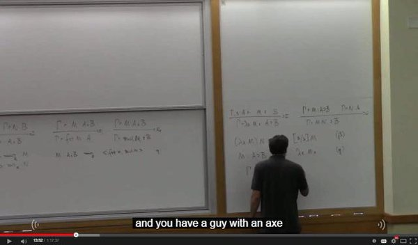

# Some types and some proofs and some things

## How to at all?

You should have a [Racket](https://racket-lang.org/) and an [Emacs](https://www.gnu.org/software/emacs/). Racket should be on `PATH` so that can be startet with `racket`. Emacs should support displaying PNGs.

Set environment variable `HOME` to this repo-dir, run Emacs. Maybe it works!?

## Does the Axe of Taipei give like +2 dex or sth?

YouTube used to subtitle "a gamma with an x of type A" as "a guy with an axe of Taipei."

## Can maybe just view the stuff from the flatMap(Oslo) talk without doing the Racket bits?

Yes. If you checkout this branch. Run Emacs and open the [flat17.txt](lambs/flat17.txt) file, you mostly get the stuff from the talk. You still need to set HOME to the repo-dir in order to show the pictures (do `C-x C-e` on the insert-pic-expressions to insert pics), but you won't need any Racket bits for it.
